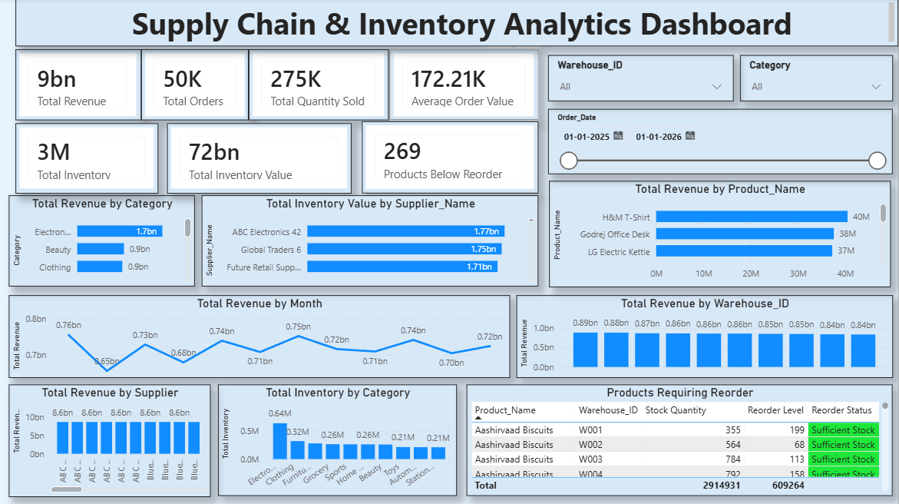

# Supply Chain & Inventory Analytics

## 📌 Project Overview

This project analyzes supply chain, inventory, sales, supplier, and warehouse data using SQL and Power BI.

The goal is to identify inventory risks, analyze sales performance, evaluate suppliers and warehouses, and generate actionable business insights.

## 🎯 Business Objectives

- Analyze total sales and order performance
- Identify products that require stock replenishment
- Analyze inventory levels across warehouses
- Evaluate supplier performance
- Compare warehouse performance
- Identify top-performing products and categories
- Analyze monthly revenue trends
- Support data-driven inventory decisions

## 🛠️ Tools & Technologies

- **SQL / MySQL** – Data analysis and business queries
- **Power BI** – Interactive dashboard and visualization
- **Python / Pandas** – Data generation and preparation
- **Excel** – Data inspection and validation
- **GitHub** – Project documentation and version control

## 🗄️ Database Structure

The project contains five main tables:

| Table | Records |
|---|---:|
| Products | 550 |
| Inventory | 5,500 |
| Orders | 50,000 |
| Suppliers | 50 |
| Warehouses | 10 |

### Main Tables

**Products**
- Product_ID
- Product_Name
- Category
- Brand
- Unit_Cost
- Unit_Price

**Inventory**
- Inventory_ID
- Product_ID
- Warehouse_ID
- Supplier_ID
- Stock_Quantity
- Reorder_Level

**Orders**
- Order_ID
- Order_Date
- Product_ID
- Warehouse_ID
- Quantity
- Unit_Price
- Total_Amount

**Suppliers**
- Supplier_ID
- Supplier_Name
- Country
- Lead_Time_Days
- Rating

**Warehouses**
- Warehouse_ID
- Warehouse_Name
- City
- Region
- Capacity

## 📊 SQL Analysis

SQL was used to analyze:

- Revenue by category
- Revenue by product
- Revenue by supplier
- Revenue by warehouse
- Monthly revenue trends
- Inventory levels
- Products below reorder level
- Supplier performance
- Warehouse performance
- Supplier lead times and ratings

## 📈 Power BI Dashboard

The Power BI dashboard provides an interactive overview of supply chain performance.

### Dashboard Preview



### Key KPIs

- Total Revenue: ₹9+ Billion
- Total Orders: 50K
- Total Quantity Sold: 275K
- Average Order Value: ₹172.21K
- Total Inventory: 3M
- Total Inventory Value: ₹72+ Billion
- Products Below Reorder: 269

### Dashboard Features

- Revenue by Category
- Revenue by Product
- Revenue by Month
- Revenue by Warehouse
- Revenue by Supplier
- Inventory by Category
- Product Reorder Status
- Warehouse and Category filters
- Order date filtering

## 🔍 Key Insights

- Electronics generated the highest revenue among categories.
- H&M T-Shirt was the highest-revenue product in the analyzed product ranking.
- Mumbai Warehouse recorded the highest warehouse revenue.
- Several products were below their reorder levels and require replenishment.
- Supplier performance varies based on revenue contribution, lead time, and rating.
- Monthly revenue remained relatively consistent throughout 2025.

## 📁 Project Structure

```text
Supply-Chain-Analytics/
│
├── SQL/
│   └── supply_chain_analysis.sql
│
├── README.md
│
└── Power BI/
    └── Supply Chain & Inventory Analytics Dashboard
